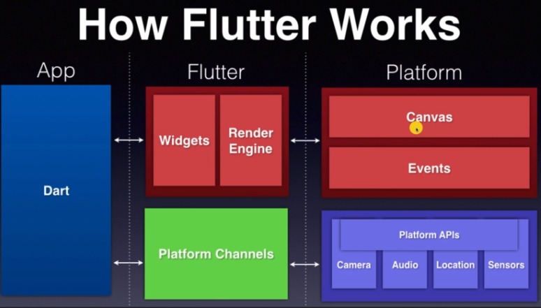
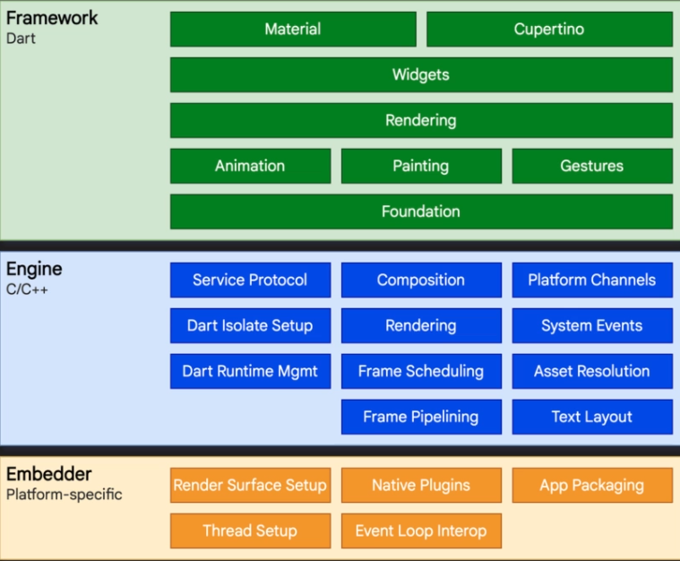
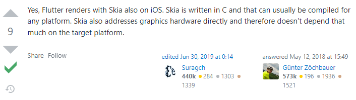
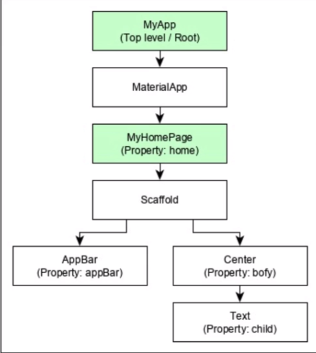
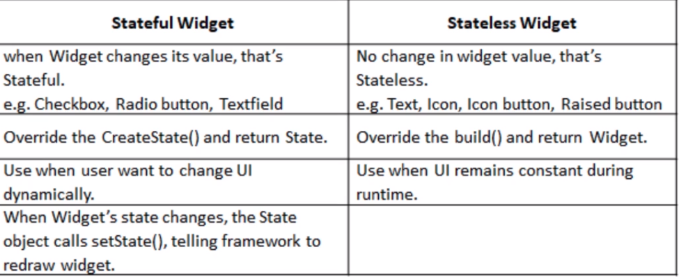
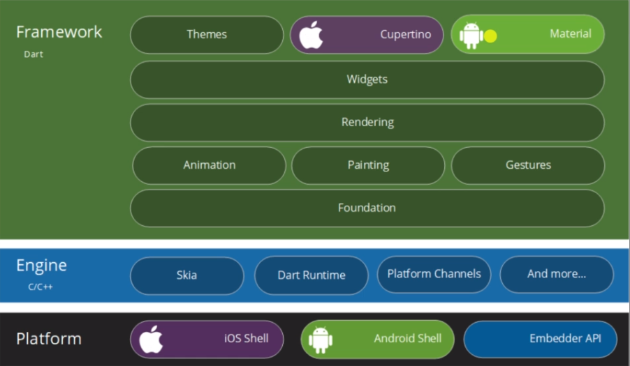
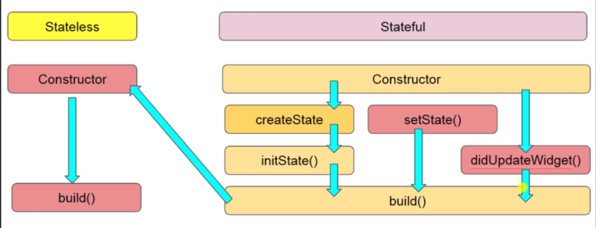
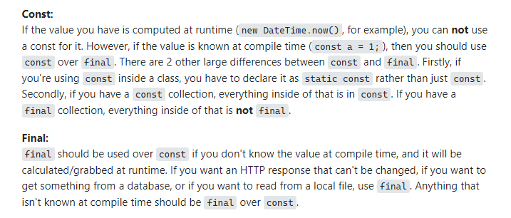
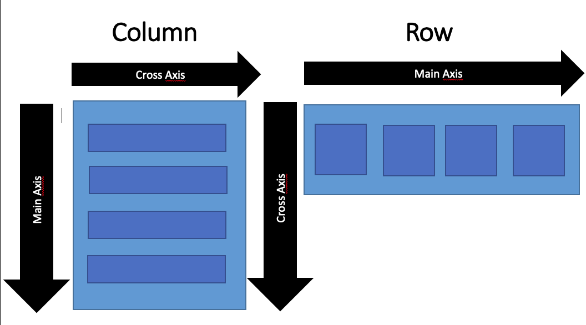

#### Mobile Environment

---

Native: Native support (aspect ratio, speed, adv. UI interactions, native look), obviously interact directly with hardware since developed by companies themselves.

Web (Progressive Web): access to device level hardware that  general web apps don't (prob. through interface), reduced dev cost, accessible on all platforms, require internet (are we sure, mostly just html rendering + reading through browser)

Hybrid: Actual native app. but runs web view (browser) that renders content. Offline Support!!

**Single code base that compiles natively (device itself)**

#### Flutter

---

Google SDK, Support iOS, Android, Web and Desktop but..

Compiles to native code with offline support

**Flutter** renders your app itself rather than through platform, **no bridge or context switch** (look into). Does this by relying only on Canvas + Events + Platform API (Platform neutral resources).



Obviously differs from native dev. that have separate code base for platforms, also differs from web based platforms that use web views (create html and display through web view). This is the bridge from device to application rendering (Application is running on Application layer rather than natively). 

**Flutter** uses Dart framework and **C++ rendering engine Skia**, because all top components are through Dart application itself, rather than going through the interface for web apps, there is a complete stack track for the top components. **Every component on screen is a widget.**



**Dart** combines **JIT compilation**, hot reload, (compilation that mimics interpreter, compiles on change (like TS?) to allow for instant view (hated that long compilation time for Scala))+ ahead of time compilation (type safety).

**Skia**: 

**Basic Components**

1. Widgets: Composable widgets, basic building block. Scaffold holding up different components for screen (image 2 is how they are visually composed) 

2. Gestures: Skia is the application (C++ graphics engine) that renders everything (is Skia built to be platform specific, but it's in C++, which I guess compiles to device compatible code). Gestures are done through platform channels, bridge between framework and platform native API. Gesture detector widget listens and notifies to call API.

3. State: Data associated with widget, can be read synchronously on build but then modified asynchronously.  

4. Layers: Application runs through Dart Runtime (iOS shell vs Android Shell vs Embedder API) 

5. UI:

   **Widget Life Cycle**:

    

   ### Dart

   ---

   Very standard stuff, final vs const?

   **Null Safety** means variables can't be unassigned unless annotated **String?**

   **late** keyword stays unassigned but will be assigned later (should throw warning?)

   number (int double(64bit float)), string, boolean, map

   **const vs final**: whether value is known at compile time, final can be assigned during runtime, const cannot 

   
   
   
   
   positional parameters first, named arguments after positional, named arguments without ? must be default value or required
   
   ```dart
   void printToConsole(String string1, {String? extraString, String extraString2: 'default'}) {
       if (extraString != null) print(extraString);
       print(extraString2);
   }
   void requiredArgument({required String notNull, String default: 'default'}) { print(notNull); }
   printToConsole(extraString: 'test');
   ```
   
   https://dart.dev/null-safety/understanding-null-safety
   
   ```dart
   void nullableTest(String? yesNull, String noNull) {
       print(yesNull);
   }
   ```
   
   https://dart.cn/articles/archive/event-loop
   
   https://dart.dev/codelabs/async-await
   
   **playing around with type system**
   
   ```dart
   T mirror<T>(T value) => value;
   T mirror2<T>(T arg) { return arg; }
   void typeSafety() {
       var testList1 = [1, 2, 'a']; // List<Object>
       testList1.forEach((e) => print(e));
       testList1.map((e) => mirror(e));
       // Any function/methods not inherent to Object will throw error
       var testList2 = [2, 3, 4]; // inference List<Integer>
       testList2.forEach((e) => print(e));
   	testList2.map((e) => mirror(e));
   }
   ```
   
   **playing around with maps**
   
   ```dart
   int mapReturn(Map<String, int> a) => a['test']; // this doesn't work because return type is int? (key may not exist)
   int? mapReturn(Map<String, int> a) => a['test'];
   int? mapReturn2(Map<String, int> a) = { return a['test']; }
   ```
   
   **playing around with futures (this distinction is very important)**
   
   ```dart
   void main async {
       //await futureFunction1(); hello comp. done vs. comp. done hello
       await FutureFunction2();
       print('hello');
   }
   Future futureFunction1() async {
       Future.delayed(Duration(seconds: 2)).whenComplete(() => print('Computation Done'));
   }
   Future futureFunction2() async {
       Await Future.delayed(Duration(seconds: 2)).whenComplete(() => print('Computation Done'));
   }
   ```
   
   **null safety**
   
   late keyword (final, const, stateless) what are guarantees?, assertion + nullable kind of sketch
   
   why is this wrong
   
   ```dart
   String fullName(String first, String last, [String middle]) {
    return middle == null? '$first $last': '$first $middle $last';
   }
   String fullName2(String first, String last, {required String middle})
   // Named parameters confused with Optional Parameters
   var wrong = fullName('First', 'Last', middle: 'Middle');
   var right = fullName('First', 'Last', null);
   ```
   
   ## Flutter
   
   ---
   
   Start project with **flutter create**
   
   start emulator, lib\main.dart build project, hot reload
   
   build, .dart_tool, .idea, android, ios, linux, mac, windows, web, lib (main app code), test, pubspec.yaml (dependencies)(pub.dev)
   
   Build everything from widget runApp(widget)
   
   

```dart
void main() {
    runApp(const MainApp());
}

class MainApp extends StatelessWidget {
    const MainApp({Key? key}) : super(key: key); // key is constructor requirement for widgets? id?
    // All widgets wheter stateless or stateful call the build method
    @Override
    Widget build(BuildContext context) {
        return MaterialApp(
        	title: 'GoMoon',
            theme: ThemeData(scaffoldBackgroundColor: Color.fromRGBO(31, 31, 31, 1.0)),
            home: Scaffold(),
        );
    }
}
```


MaterialApp(theme: ThemeData()) => passed down to? scaffold, prob to everything (widget) under MaterialApp as default?

Build on top of Scaffold for main page currently

**package:flutter/material.dart**

home: HomePage() <- defined elsewhere

body: Contained() <- Contained widget

pubspec.yaml / flutter: assets 

dart public vs private = _

**Interestingly still Stateless, because build() will not be called again, deviceHeight, deviceWidth defined once during runtime, and will not be changed again..adding final maybe?**

```dart
class HomePage extends StatelessWidget {
    // This info is defined by BuildContext
    late double _deviceHeight, deviceWidth;
	HomePage({Key? key} : super(key: key));
    @override
    Widget build(BuildContext context) { 
        _deviceHeight = MediaQuery.of(context).size.height;
        _deviceWidth = MediaQuery.of(context).size.width;
        Scaffold();
    }
}
```

**area will never grow bigger than parent ... SafeArea(Container(deviceHeight, deviceWidth))**

stack: layering on top of each other like photoshop

**this one is fun**

```dart
// Converting List<String> to List<DropdownMenuItem>, just like good old Scala days
List<DropdownMenuItem<String>> _items = ['James Webb Station', 'Preneure Station'].map(e =>
	DropdownMenuItem(child: Text(e), value: e)
).toList();
```

```dart
List<String> _items = ['James Webb Station', 'Preneure Station'];
_items.map((e) => DropdownMenuItem(child: Text(e), value: e)).toList();
```


Important that .map() converts the list into an iterable which you can then reconvert to list

**Also important to understand they layering of these objects and how big they are, can test with the color coding trick**



**42**


